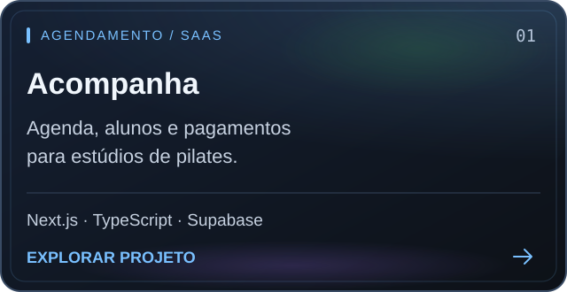
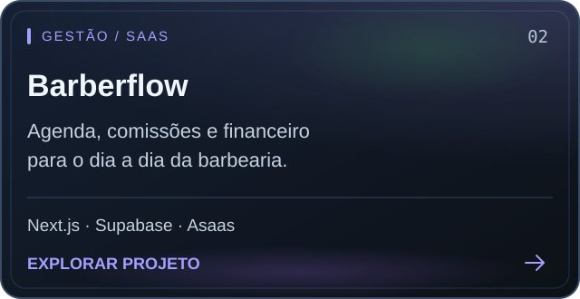
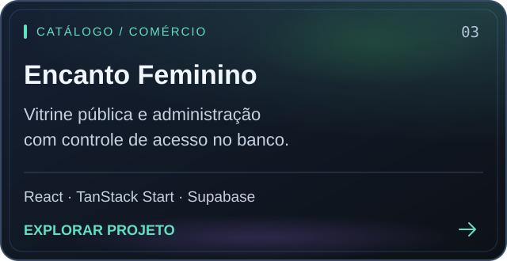
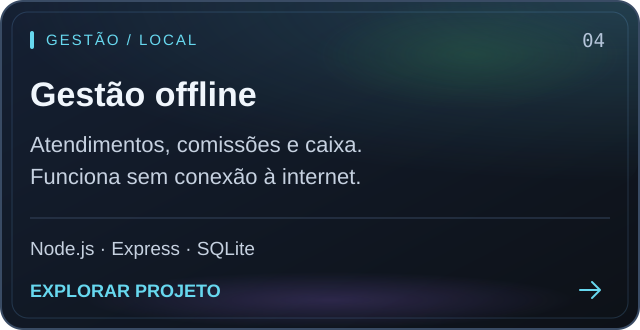

  <a href="https://portfolio-mauve-two-57.vercel.app"><strong>Portfólio ↗</strong></a>
  &nbsp; · &nbsp;
  <a href="https://www.linkedin.com/in/carlos-mchagas"><strong>LinkedIn ↗</strong></a>
  &nbsp; · &nbsp;
  <a href="mailto:alberttcarlosu.u@gmail.com"><strong>Fale comigo ↗</strong></a>

Desenvolvedor full-stack em Recife. Construo sistemas de gestão, agendamento e comércio — da interface ao banco de dados.

## Projetos em destaque

  
  

  
  

<a href="https://github.com/ConnorOmarley?tab=repositories">Todos os repositórios →</a>

Ver projetos em texto

- **[Acompanha](https://github.com/ConnorOmarley/sistema_agendamento)** — agenda, alunos e pagamentos para estúdios de pilates. Next.js · TypeScript · Supabase.
- **[Barberflow](https://github.com/ConnorOmarley/barberflow-saas)** — agenda, comissões e financeiro para barbearias. Next.js · Supabase · Asaas.
- **[Encanto Feminino](https://github.com/ConnorOmarley/encanto-feminino-catalogo)** — vitrine pública e administração com controle de acesso. React · TanStack Start · Supabase.
- **[Gestão offline](https://github.com/ConnorOmarley/sistema-gestao-barbearia)** — atendimentos, comissões e financeiro sem internet. Node.js · Express · SQLite.

## Tecnologias

**Frontend** &nbsp; React · Next.js · TypeScript · JavaScript · Tailwind CSS 
**Backend** &nbsp; Node.js · Express · PHP · Supabase 
**Dados** &nbsp; PostgreSQL · MySQL / MariaDB · SQLite

**Em equipe:** [InterADS4M / ONG SOS](https://github.com/Matheus-Br09/InterADS4M), com @Matheus-Br09 e equipe, e [Pizzaria Taurus](https://github.com/ConnorOmarley/pizzaria), com [@Fabioshit](https://github.com/Fabioshit).

## Atividade no GitHub

### Calendário de contribuições

  

Minhas contribuições em modo arcade · Atualização diária

Ver calendário estático

[Consultar minhas contribuições no GitHub](https://github.com/ConnorOmarley?tab=overview).

 

  <strong>Vamos conversar sobre seu próximo projeto?</strong> 
  <a href="mailto:alberttcarlosu.u@gmail.com">alberttcarlosu.u@gmail.com</a>  
  Recife, PE · Brasil · Carlos Alberto

